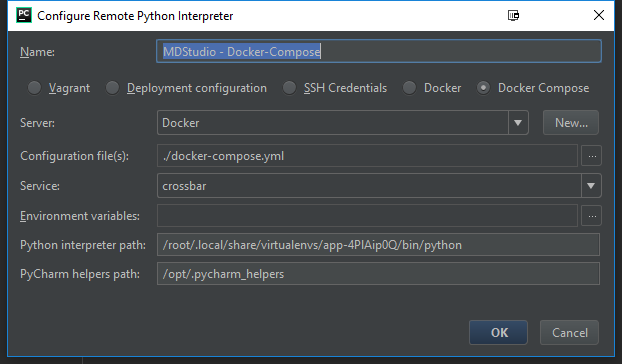

# MDStudio

MDStudio is a stand-alone application featuring a web based graphical user interface.
Most of the application is written in Python. The web based GUI runs as a client side
Angular application.
    
## Docker
To make development easier we have setup a docker environment.

### Prerequisites

 * [Docker](https://www.docker.com/), that's it.

### Installation
Run the builder under bash:

    >> ./build.sh

### Usage
To use the docker environment you have to start the container:

    >> ./start.sh

This command will spin up the complete environment including MongoDB, and logs in into the 
container. When you want to exit this mode just use `>> exit` to exit. Containers can be
stopped using:

    >> ./stop.sh

### IDE Integration

#### Pycharms
Go to `File > Project Settings > Project Interpreter`, and add a remote interpreter,
and make sure it matches this screen.



Note specifically:
|                      |                                                            |
|----------------------|------------------------------------------------------------|
| Interpreter path     | `/root/.local/share/virtualenvs/app-4PlAip0Q/bin/python`   |

## Manual
When you want to keep track of the whole environment for yourself, you should follow these
instructions.

### Prerequisites
The MDStudio application is written in Python and mostly self contained thanks to the
use of an in-application Python virtual environment.
The application has currently been successfully tested with Python versions: 2.7

The only external dependencies are:

 * [MongoDB](https://www.mongodb.com) - A NoSQL database.
 * [Pipenv](https://github.com/kennethreitz/pipenv) - A python virtual environment manager

### Installation
Install the virtual environment with:

    >> pipenv install --skip-lock --dev --sequential

You can install the virtual environment in your directory by enabling the environment variable:
```
PIPENV_VENV_IN_PROJECT = 1
```
For more information see [this](https://docs.pipenv.org/advanced.html#custom-virtual-environment-location).
  
### Usage
The application is started on the command line as:

    >> pipenv shell
    >> python .